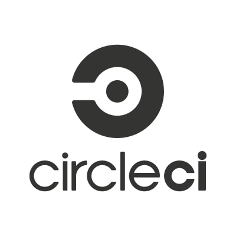

<h1 align="center">Hi 👋, I'm Debankan Mitra</h1>
<h3 align="center">I'm a Full-stack AI developer exploring the vast landscape of artificial intelligence to build innovative applications. 🚀</h3>

  

 <a href="https://twitter.com/mitra_debankan" target="blank">

- 💬 Ask me about **Backend Development, Devops, Aws, Generative AI**

- 📫 You can reach me through socials or email 

- ⚡ Fun fact **I've discovered the perfect coding playlist that magically boosts my productivity. 🎧💻**

<h3 align="left">Connect with me:</h3>

<h3 align="left">Languages and Tools ></h3>
 <a>         

<h3 align="left">Databases ></h3>
   

<h3 align="left">Devops ></h3>
 
 

