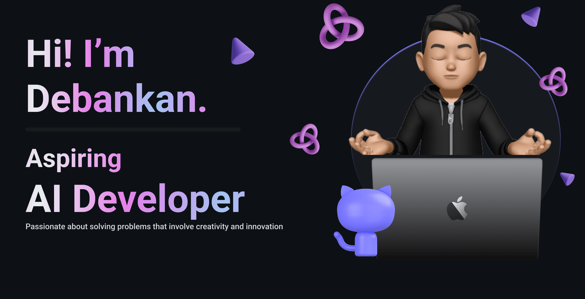

<h1 align="center">Hi 👋, I'm Debankan Mitra</h1>
<h3 align="center">I'm a Full-stack AI developer, immersing myself in the intricacies of Generative AI & Language Models. Exploring the vast landscape of artificial intelligence to build innovative applications. Join me on this journey of coding, learning, and creating in the realm of AI. 🚀</h3>

  

- 💬 Ask me about **Backend Development, CICD, Aws , Generative AI**

- 📫 How to reach me **debankanmitra@gmail.com**

- ⚡ Fun fact **I've discovered the perfect coding playlist that magically boosts my productivity, and yes, it includes a mix of electronic beats and classic rock. 🎧🤘💻**

<h3 align="left">Connect with me:</h3>

<h3 align="left">Languages and Tools:</h3>

 

 

 
 
 
 
 
 
 
 
 
 
 
